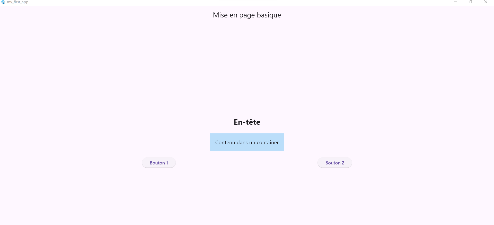

# mise-en-page-basique

Objectif :

L’objectif de ce TP est de créer une interface simple en utilisant les widgets de base de Flutter afin de comprendre :

- L’organisation verticale avec Column

- L’organisation horizontale avec Row

- L’utilisation de Container

- L’ajout d’espacement avec SizedBox

- L’utilisation de boutons interactifs

Description de l’application :

L’application contient :

- Une barre supérieure (AppBar) avec le titre "Mise en page basique"

- Un texte principal servant d’en-tête

- Un conteneur coloré contenant du texte

- Deux boutons alignés horizontalement

 Widgets utilisés :
 
🔹 Column

Permet d’organiser les éléments verticalement.

Column(

  mainAxisAlignment: MainAxisAlignment.center,
  
)

🔹 Text

Affiche du texte avec style personnalisé :

TextStyle(fontSize: 24, fontWeight: FontWeight.bold)

🔹 SizedBox

Ajoute un espace vertical entre les widgets :

SizedBox(height: 20)

🔹 Container

Permet de :

Ajouter du padding

Ajouter une couleur de fond

Structurer un bloc de contenu

🔹 Row

Permet d’aligner les widgets horizontalement.

Row(

  mainAxisAlignment: MainAxisAlignment.spaceEvenly,

)

🔹 ElevatedButton

Crée des boutons interactifs.

ElevatedButton(

onPressed: () {},

  child: Text('Bouton 1'),
  
)

🎨 Material Design et Cupertino :

- Flutter propose deux systèmes de design :

- Material Design → utilisé principalement pour Android

- Cupertino → utilisé pour les applications iOS

Dans ce TP, nous avons utilisé Material Design via les widgets :

- MaterialApp

- Scaffold

- AppBar

- ElevatedButton

✅ Résultat final :

L’application affiche :

- Un en-tête centré

- Un bloc coloré avec texte

- Deux boutons alignés horizontalement

- Une mise en page propre et structurée

 Conclusion :

Ce TP permet de comprendre les bases de la mise en page dans Flutter en utilisant des widgets simples.

Il constitue une étape importante pour apprendre à structurer des interfaces plus complexes.

Deux boutons alignés horizontalement
